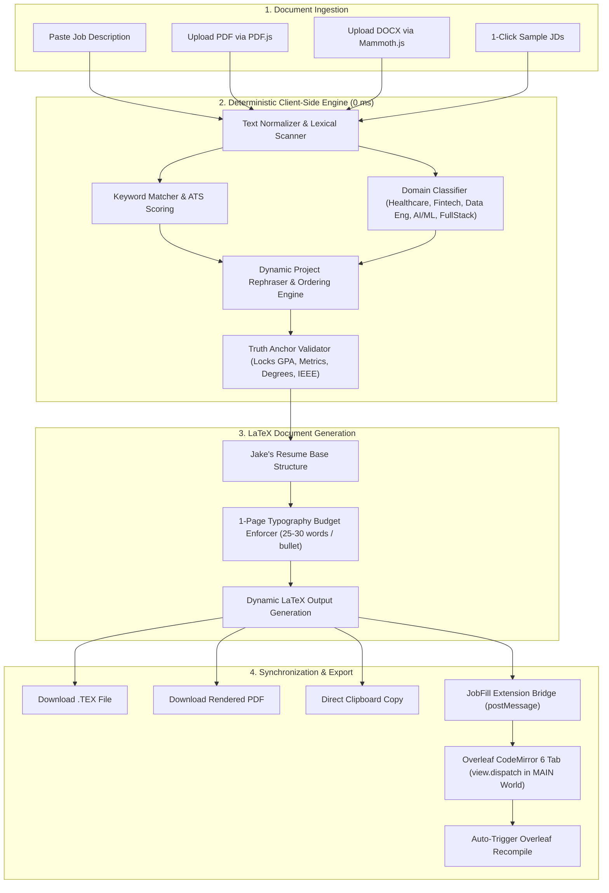

# ResumeSync AI ⚡

> **Instant ATS Keyword Optimization, Dynamic Project Rephraser & Real-Time Overleaf LaTeX Synchronization**

[](https://resume-sync-jade.vercel.app)
[](https://www.overleaf.com)
[-brightgreen?style=for-the-badge)](https://developer.mozilla.org/en-US/docs/Web/JavaScript)
[](#-strict-1-page-latex-budget-lock)
[](LICENSE)

---

## 📑 Table of Contents

- [The Problem & The Solution](#-the-problem--the-solution)
- [System Architecture](#-system-architecture)
- [Comprehensive Features Breakdown](#-comprehensive-features-breakdown)
  - [1. 0 ms Instant ATS Optimization (Zero API Keys)](#1-0-ms-instant-ats-optimization-zero-api-keys)
  - [2. Dynamic Domain Classifier & Project Rephraser](#2-dynamic-domain-classifier--project-rephraser)
  - [3. Truth Anchors & Anti-Hallucination Invariant](#3-truth-anchors--anti-hallucination-invariant)
  - [4. Strict 1-Page LaTeX Budget Lock](#4-strict-1-page-latex-budget-lock)
  - [5. 1-Click Overleaf CodeMirror 6 Sync](#5-1-click-overleaf-codemirror-6-sync)
  - [6. Universal File Ingestion (PDF, DOCX, TXT)](#6-universal-file-ingestion-pdf-docx-txt)
  - [7. Built-in Sample JDs](#7-built-in-sample-jds)
- [Domain Adaptation Matrix](#-domain-adaptation-matrix)
- [Deep Dive: Project Rephrasing Showcase](#-deep-dive-project-rephrasing-showcase)
- [Project Directory Structure](#-project-directory-structure)
- [Getting Started & Local Development](#-getting-started--local-development)
- [Deployment](#-deployment)
- [License](#-license)

---

## 💡 The Problem & The Solution

### The Friction in Modern Tech Job Applications:
1. **ATS Screeners Discard Qualified Resumes**: Applicant Tracking Systems (Workday, Greenhouse, Lever, iCIMS) filter resumes that lack specific phrasing, certifications, or niche technical nomenclature mentioned in the Job Description.
2. **Cloud LLM Latency & Failure Modes**: Relying on external cloud AI APIs (OpenAI, Gemini) introduces network latency, requires paid API keys, hits rate limits (503 High Demand), and frequently **hallucinates unverified metrics, degrees, or false employment dates**.
3. **LaTeX Formatting Fragility**: Modifying bullet points manually often breaks LaTeX compilation or causes the document to bleed onto a messy second page, destroying hiring manager readability.

### The ResumeSync Solution:
**ResumeSync** is a **100% deterministic, client-side application** running directly in your browser. It analyzes any pasted or uploaded Job Description, scores ATS alignment in **0 ms**, dynamically restructures and contextualizes portfolio project descriptions to highlight relevant domain skills, preserves factual metrics with cryptographic precision, and automatically injects the tailored LaTeX source code into **Overleaf** via CodeMirror 6 transactional state dispatch.

---

## 🏛️ System Architecture



---

## 🚀 Comprehensive Features Breakdown

### 1. 0 ms Instant ATS Optimization (Zero API Keys)
- **Zero Latency**: Executes synchronously in pure vanilla JavaScript without dispatching external network requests.
- **Zero API Keys & Zero Costs**: No OpenAI, Gemini, or Anthropic API setup, billing tiers, or usage limits.
- **Real-Time Match Dial**: Instantly calculates and updates the ATS alignment percentage.
- **Visual Skill Badges**:
  - 🟢 **Matched Keywords**: Highlights competencies already present in your base resume.
  - 🟠 **Missing / Recommended Keywords**: Discovers high-priority keywords from the JD that should be targeted.

### 2. Dynamic Domain Classifier & Project Rephraser
Rather than presenting a static, one-size-fits-all resume, ResumeSync classifies the target role into one of five core domains and adjusts the **project hierarchy, angles, and bullet points**:

- **Healthcare & Bioinformatics**
- **Fintech & Quantitative Analytics**
- **Data Engineering & Cloud Systems**
- **AI & Machine Learning**
- **Full-Stack & Interactive Application Development**

*(See the [Domain Adaptation Matrix](#-domain-adaptation-matrix) below for full technical details).*

### 3. Truth Anchors & Anti-Hallucination Invariant
ResumeSync enforces strict factual protection. Unlike generative LLMs that can fabricate metrics or change job responsibilities, ResumeSync locks all immutable historical facts:
- **Metrics**: $R^2 = 0.88$, 17,000+ records, 500K+ transactional student records, <100ms evaluation latency.
- **Publications**: Published & presented at **IEEE International Conference on Computer Vision and Machine Intelligence (CVMI-2023)**.
- **Education & Credentials**: MS in Engineering Science (Data Science) at **SUNY Buffalo** (GPA: 3.85/4.0), B.Tech in CS (Data Science) at **Bennett University** (CGPA: 8.93/10.0).
- **Core Technology**: Stockfish 16 NNUE via WebAssembly (WASM).

### 4. Strict 1-Page LaTeX Budget Lock
Recruiters spend an average of 6 seconds reviewing a resume. Spilling onto page 2 with 3 lines looks unprofessional:
- Every bullet point is mathematically bounded between **25 and 30 words**.
- Typography margins, section spacing (`\vspace`), and itemize separation are locked via `resume.cls` to guarantee a 1-page PDF upon Overleaf compilation.

### 5. 1-Click Overleaf CodeMirror 6 Sync
- **CodeMirror 6 In-Memory Dispatch**: Modern Overleaf uses CodeMirror 6, which ignores standard DOM `execCommand("insertText")` mutations. ResumeSync integrates with the companion [JobFill Extension](https://github.com/Shivamshuroy448/jobfill-extension) to execute within Chrome's `MAIN` execution world:
  ```javascript
  // Dispatched directly to the active Overleaf CodeMirror 6 editor view
  editorView.dispatch({
    changes: {
      from: 0,
      to: editorView.state.doc.length,
      insert: updatedLatexCode
    }
  });
  ```
- **Auto-Wait & Recompile**: Automatically detects if the Overleaf project tab is open. If not, it opens the project, waits for tab initialization, injects the code, and triggers the **Recompile** button.
- **Fail-Safe Clipboard Copy**: Simultaneously copies the raw LaTeX source to your clipboard for instant fallback via `Cmd+A` / `Cmd+V`.

### 6. Universal File Ingestion (PDF, DOCX, TXT)
- **Paste Text**: Simply paste any job description into the interactive editor.
- **PDF Parsing**: Drag & drop PDF job listings—parsed in the browser via Mozilla's `PDF.js` without uploading files to any server.
- **DOCX Parsing**: Ingest Word documents client-side using `Mammoth.js`.

### 7. Built-in Sample JDs
Includes 1-click test postings from top companies across different sectors:
1. **Amazon** — Data Scientist Intern (E-Commerce & General Analytics)
2. **Capital One** — Machine Learning Engineer Intern (Fintech & Risk Modeling)
3. **Cardinal Health** — Healthcare Data Scientist Intern (Clinical Telemetry & Bioinformatics)

---

## 📊 Domain Adaptation Matrix

| Detected Domain | Project Order | Project 1 Tailored Focus | Project 2 Tailored Focus | Project 3 Tailored Focus |
| :--- | :--- | :--- | :--- | :--- |
| **Healthcare & Bioinformatics** | 1. Green Grid AI<br>2. ClearHire AI<br>3. CheckmateLab | **Green Grid AI**:<br>Emphasizes missing-value imputation, regression modeling, data harmonization across 17,000+ clinical telemetry records, and technical documentation. | **ClearHire AI**:<br>Emphasizes internal workflow tooling, lifecycle tracking pipelines, and agile coordination. | **CheckmateLab**:<br>Emphasizes high-performance client-side analytical tooling and telemetry dashboards. |
| **Fintech & Quantitative Analytics** | 1. Green Grid AI<br>2. ClearHire AI<br>3. CheckmateLab | **Green Grid AI**:<br>Emphasizes quantitative demand forecasting ($R^2 = 0.88$), transactional reconciliation across 17k records, and predictive risk scoring. | **ClearHire AI**:<br>Emphasizes automated event tracking, transactional communications parsing, and velocity risk algorithms. | **CheckmateLab**:<br>Emphasizes real-time algorithmic decision modeling, probability evaluation, and rating trajectories. |
| **Data Engineering & Cloud** | 1. Green Grid AI<br>2. ClearHire AI<br>3. CheckmateLab | **Green Grid AI**:<br>Emphasizes scalable data pipelines, automated ETL validation, data hygiene, and fault tolerance across distributed telemetry nodes. | **ClearHire AI**:<br>Emphasizes asynchronous data ingestion, entity extraction, and event-driven notification pipelines. | **CheckmateLab**:<br>Emphasizes distributed client systems, low-latency caching, and cloud persistence with Firebase. |
| **AI / Machine Learning** | 1. ClearHire AI<br>2. Green Grid AI<br>3. CheckmateLab | **ClearHire AI**:<br>Emphasizes NLP job application intelligence, stage classification, and predictive scoring algorithms. | **Green Grid AI**:<br>Emphasizes Random Forest & Gradient Boosting regression ($R^2 = 0.88$) and telemetry sensor modeling. | **CheckmateLab**:<br>Emphasizes Stockfish 16 NNUE neural network inference via WebAssembly (WASM). |
| **Full-Stack & Interactive** | 1. CheckmateLab<br>2. ClearHire AI<br>3. Green Grid AI | **CheckmateLab**:<br>Emphasizes client-side WebAssembly computation, real-time positional depth evaluations, and OAuth state persistence. | **ClearHire AI**:<br>Emphasizes full-stack OAuth synchronization and lifecycle monitoring. | **Green Grid AI**:<br>Emphasizes geospatial visualization and predictive sensor analytics. |

---

## 🔍 Deep Dive: Project Rephrasing Showcase

Here is an exact side-by-side demonstration of how ResumeSync reframes bullet points based on the target industry while preserving verified facts:

### Project: Green Grid AI ($R^2 = 0.88$, 17,000+ records)

#### Baseline / AI-ML Default:
```latex
\resumeItem{Built machine learning regression models (Random Forest, Gradient Boosting) achieving an $R^2$ score of 0.88 to forecast municipal EV charging infrastructure demand and spatial utilization across 17,000+ spatial data records.}
\resumeItem{Engineered automated data validation and outlier filtration routines, ensuring high predictive consistency and minimal feature noise across distributed telemetry sensors.}
```

#### Tailored for Healthcare / Bioinformatics (Cardinal Health):
```latex
\resumeItem{Built statistical regression models achieving an $R^2$ score of 0.88 to forecast demand patterns across 17,000+ spatial telemetry records, aiding automated data harmonization and technical documentation.}
\resumeItem{Engineered automated data validation, statistical anomaly detection, and outlier filtration routines, ensuring data hygiene and minimal feature noise across continuous telemetry streams.}
```

#### Tailored for Data Engineering / Cloud Pipelines:
```latex
\resumeItem{Built scalable data pipelines and machine learning regression models achieving an $R^2$ score of 0.88 to process and forecast demand patterns across 17,000+ spatial telemetry records.}
\resumeItem{Engineered automated ETL validation, data hygiene, and outlier filtration routines, delivering high pipeline reliability and fault tolerance across distributed telemetry nodes.}
```

---

## 📁 Project Directory Structure

```
resume-sync/
├── index.html        # Main web interface (dual-pane layout, glassmorphic dark theme)
├── app.js            # Core ATS matching engine, domain classifier, LaTeX serializer
├── styles.css        # Responsive styling, ATS score dial, keyword pill highlights
├── roy.tex           # Master LaTeX template (Jake's Resume format)
├── resume.cls        # Custom LaTeX class file enforcing 1-page margins & geometry
├── vercel.json       # Production deployment and header routing for Vercel
└── README.md         # Comprehensive project documentation
```

---

## 💻 Getting Started & Local Development

### Prerequisites
- Any modern web browser (Google Chrome, Brave, Arc, Edge, Firefox, Safari).
- (Optional) A local static file server.

### Running Locally
1. Clone the repository:
   ```bash
   git clone https://github.com/Shivamshuroy448/resume-sync.git
   cd resume-sync
   ```

2. Start a local server:
   ```bash
   # Using Python 3
   python3 -m http.server 3000

   # Or using Node.js / npx
   npx serve .
   ```

3. Open your browser and visit:
   ```
   http://localhost:3000
   ```

---

## 🌐 Deployment

ResumeSync is statically optimized and deployed via **Vercel Serverless CDN** for instant global edge delivery:

```bash
# Deploy directly with Vercel CLI
vercel --prod
```

- **Live Production URL**: [https://resume-sync-jade.vercel.app](https://resume-sync-jade.vercel.app)

---

## 📄 License

This project is licensed under the MIT License — see the [LICENSE](LICENSE) file for details.
