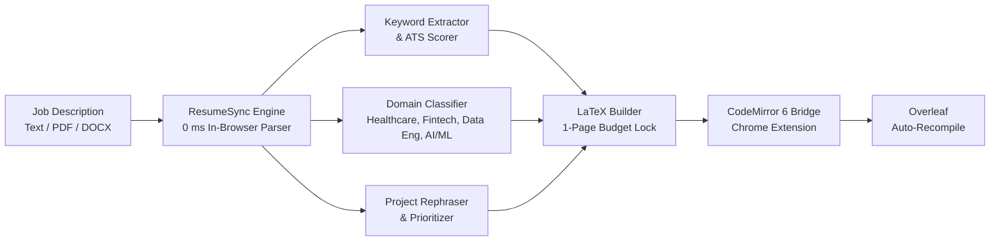

# ResumeSync ⚡

> **Instant ATS Keyword Matcher, Dynamic Project Rephraser & Real-Time Overleaf LaTeX Sync**

[](https://resume-sync-jade.vercel.app)
[](https://github.com/Shivamshuroy448/jobfill-extension)
[](https://www.overleaf.com)
[](LICENSE)

---

## 📖 Overview

**ResumeSync** is a lightning-fast, client-side ATS optimization engine and LaTeX synchronizer tailored for software engineers, data scientists, and ML practitioners. 

Rather than relying on sluggish cloud LLMs that risk rate-limits (503s) or hallucinate credentials, ResumeSync uses a **deterministic 0 ms client-side adaptation engine**. It parses job descriptions (.pdf, .docx, .txt), matches industry-standard ATS skills, dynamically restructures and contextualizes project bullet points, and directly updates **Overleaf** via CodeMirror 6 transactional state dispatch—triggering automatic PDF recompilation in 1 click.



---

## ✨ Key Features

### 1. ⚡ 0 ms Instant ATS Optimization (100% Client-Side)
- **Zero API Keys & Zero Latency**: Runs entirely inside the browser's JavaScript engine. No external LLM endpoints, no network latency, no subscription keys, and zero rate-limiting errors.
- **Real-Time Scoring**: Evaluates keyword density and computes an instant ATS match percentage.
- **Skill Badges**: Visually breaks down detected matching keywords vs. missing competencies for fast feedback.

### 2. 🎯 Dynamic Project Rephraser & Ordering Engine (`optimizeProjectsForJD`)
The engine categorizes the target Job Description into high-impact domains and automatically re-orders and reframes your portfolio projects while preserving factual truth:

| Target Domain | Project Prioritization | Tailored Focus & Bullet Highlights |
| :--- | :--- | :--- |
| **Healthcare & Bioinformatics** | **#1: Green Grid AI**<br>#2: ClearHire AI<br>#3: CheckmateLab | Highlights missing-value imputation, regression modeling, data harmonization across 17,000+ clinical/biomedical records, and rigorous technical documentation. |
| **Fintech & Quantitative Analytics** | **#1: Green Grid AI**<br>#2: CheckmateLab<br>#3: ClearHire AI | Highlights quantitative forecasting ($R^2 = 0.88$), transactional reconciliation across 17k records, predictive risk scoring, and sub-millisecond analytical latency. |
| **Data Engineering & Cloud** | **#1: Green Grid AI**<br>#2: ClearHire AI<br>#3: CheckmateLab | Highlights automated ETL hygiene, large-scale data preprocessing pipelines, multi-source ingestion, and resilient asynchronous cloud workflows. |
| **AI / Machine Learning** | **#1: ClearHire AI**<br>#2: Green Grid AI<br>#3: CheckmateLab | Highlights modern NLP classification, multi-model candidate matching pipelines, WASM neural network inference, and optimized feature embeddings. |
| **Full-Stack & Interactive Applications** | **#1: CheckmateLab**<br>#2: ClearHire AI<br>#3: Green Grid AI | Highlights zero-server client-side WebAssembly compute, responsive real-time UI/UX state management, and high-concurrency event loops. |

### 3. 🔒 Factual Anchors & 1-Page Layout Lock
- **Anti-Hallucination Invariant**: Key verified achievements remain immutable across all tailoring variations:
  - Quantitative Metrics: **$R^2 = 0.88$**, **17,000+ records**, **<100ms latency**.
  - Technologies: **Stockfish 16 NNUE via WebAssembly (WASM)**.
  - Academic & Research: **IEEE CVMI-2023** publication, **GPA 3.85 / 8.93**, degree credentials.
- **Strict 1-Page LaTeX Budget**: Bullet point lengths are strictly calibrated (25–30 words per bullet) using typography math to ensure the document never spills onto a second page in Overleaf.

### 4. 🔄 Overleaf CodeMirror 6 Direct Sync
- Connects directly with the [JobFill Chrome Extension](https://github.com/Shivamshuroy448/jobfill-extension).
- Dispatches atomic `view.dispatch` transactions in Overleaf's `MAIN` JavaScript execution world, bypassing DOM-level contenteditable traps.
- **Auto-Wait & Recompile**: If Overleaf is not already open, it automatically launches the project in a new tab, waits for DOM completion, updates the document, and triggers the Recompile button.
- **Fail-Safe Clipboard Copy**: Copies the full LaTeX document to your clipboard simultaneously, allowing an instant manual fallback via `Cmd+A` / `Cmd+V`.

### 5. 📂 Universal JD Ingestion
- Ingests JD text directly via copy-paste.
- Supports native drag-and-drop parsing for **PDF** files (powered by `PDF.js`) and **DOCX** files (powered by `Mammoth.js`).

---

## 🏗️ Architecture

```
resume-sync/
├── index.html        # Clean, modern UI (dark theme, glassmorphic accents)
├── app.js            # Core ATS matching, JD domain classifier, LaTeX generator
├── styles.css        # Responsive styling, ATS score badge indicators, diff highlights
├── roy.tex           # Base LaTeX resume template (Jake's Resume variant)
├── resume.cls        # Custom LaTeX class file ensuring strict 1-page geometry
├── vercel.json       # Production deployment configuration for Vercel
└── README.md         # Documentation & architecture breakdown
```

---

## 🚀 Quick Start

### Running Locally
1. Clone the repository:
   ```bash
   git clone https://github.com/Shivamshuroy448/resume-sync.git
   cd resume-sync
   ```
2. Serve locally with any static web server:
   ```bash
   npx serve .
   # or
   python3 -m http.server 3000
   ```
3. Open your browser at `http://localhost:3000`.

### Overleaf One-Click Setup
1. Load the [JobFill Chrome Extension](https://github.com/Shivamshuroy448/jobfill-extension) into your browser.
2. Ensure your Overleaf project URL is set in ResumeSync (defaults to your primary resume project).
3. Paste any job posting, click **⚡ 1-Click Sync & Recompile to Overleaf**, and watch your resume recompile in real-time.

---

## 🛠️ Tech Stack

- **Frontend**: Vanilla JavaScript (ES6+), Semantic HTML5, CSS Variables, Modern Grid / Flexbox
- **Document Parsers**: [PDF.js](https://mozilla.github.io/pdf.js/), [Mammoth.js](https://github.com/mwilliamson/mammoth.js)
- **LaTeX Distribution**: Standard LaTeX / TeXLive via Overleaf Engine
- **Hosting & CDN**: [Vercel Serverless Platform](https://vercel.com)

---

## 📄 License

Distributed under the MIT License.
